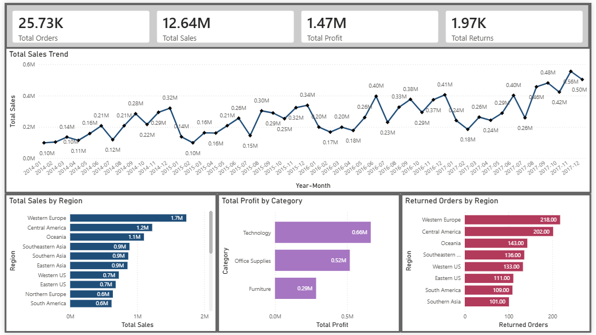
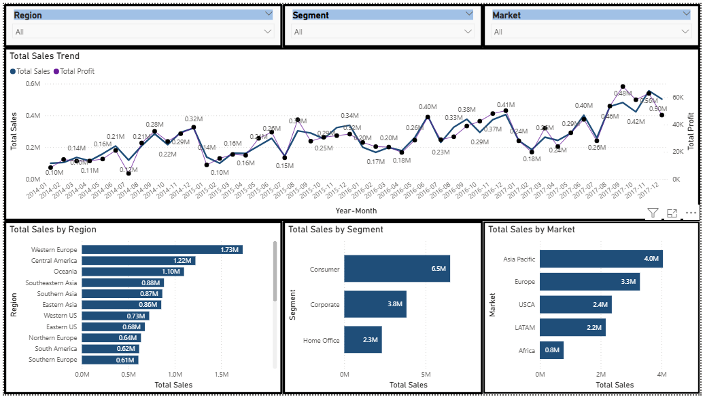
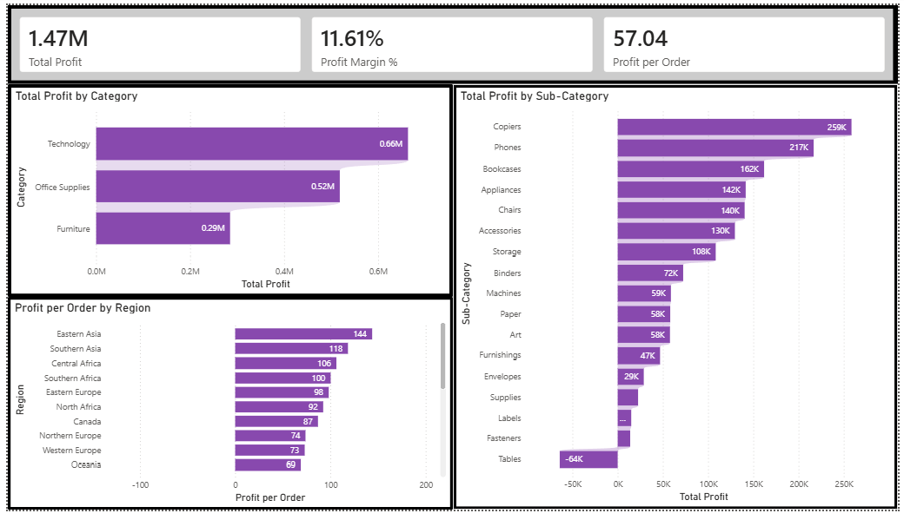
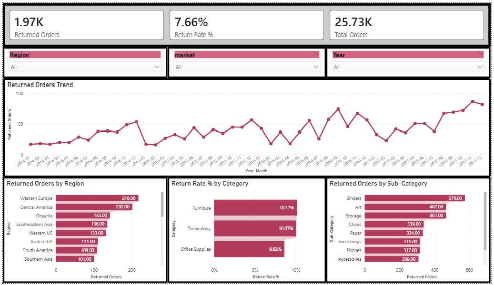

# Global Superstore Analysis | Power BI

An end-to-end Power BI portfolio project that analyses global sales performance, profitability, and product returns using the Global Superstore dataset.

## Dashboard preview

| Overview | Sales Trends |
| --- | --- |
|  |  |

| Profitability | Returns & Regional |
| --- | --- |
|  |  |

## Project objective

Build an interactive report that helps stakeholders:

- Monitor overall sales, profit, order volume, and returns.
- Identify sales and profit trends over time.
- Compare profitability across categories, sub-categories, and regions.
- Identify categories, regions, and sub-categories with elevated return activity.

## Report pages

1. **Overview** — headline KPIs, monthly sales trend, sales by region, and profit by category.
2. **Sales Trends** — sales and profit trends over time, with Region, Segment, and Market slicers.
3. **Profitability** — profit by category and sub-category, profit margin, and profit per order by region.
4. **Returns & Regional** — returned orders, return rate, return patterns by region, category, sub-category, and month.

## Tools and skills

- **Python** — loading, cleaning, and exporting source data.
- **Power Query** — data types and data preparation.
- **Power BI** — data modelling, report design, interactivity, slicers, and report-page tooltips.
- **DAX** — measures, calendar table, profitability metrics, and return analysis.

## Data workflow

```text
Raw CSV files → Python cleaning scripts → Processed CSV files → Power Query → Power BI data model → DAX measures → Interactive dashboard
```

The `data/raw/` folder contains the source files. The `data/processed/` folder contains the cleaned files loaded into Power BI. Cleaning steps are documented in the Python scripts under `scripts/`.

## Data model

The report uses `orders_clean` as the central fact table, linked to:

- `Calendar[Date]` → `orders_clean[order_date]`
- `people_clean[region]` → `orders_clean[region]`
- `returns_clean[order_id]` → `orders_clean[order_id]`

A custom DAX calendar table supports Year, Month, Week, Quarter, and chronological Year-Month sorting.

## Key DAX measures

```DAX
Total Sales = SUM(orders_clean[sales])

Total Profit = SUM(orders_clean[profit])

Total Orders = DISTINCTCOUNT(orders_clean[order_id])

Profit Margin % = DIVIDE([Total Profit], [Total Sales])

Profit per Order = DIVIDE([Total Profit], [Total Orders])

Total Returns = COUNTROWS(returns_clean)

Returned Orders =
CALCULATE(
    DISTINCTCOUNT(returns_clean[order_id]),
    TREATAS(VALUES(orders_clean[order_id]), returns_clean[order_id])
)

Return Rate % = DIVIDE([Returned Orders], [Total Orders])
```

## Interactivity

The report includes:

- Page-level slicers for Region, Segment, Market, and Year.
- Four report-page tooltips that provide deeper context for regions, months, sub-categories, and returns.
- Drillable visual analysis across sales, profit, and return metrics.

## Repository structure

```text
Global_superstore_analysis/
├── data/
│   ├── raw/                  # Original CSV files
│   └── processed/            # Cleaned CSV files used in Power BI
├── scripts/
│   ├── 01_load_and_export.py
│   └── 02_clean_data.py
├── screenshots/
│   ├── overview.png
│   ├── sales-trends.png
│   ├── profitability.png
│   └── returns-regional.png
├── Global_Superstore_Analysis_v2.pbix
└── README.md
```

## How to use

1. Clone or download this project.
2. Keep the folder structure unchanged so Power BI can locate the processed CSV files.
3. Open `Global_Superstore_Analysis_v2.pbix` in Power BI Desktop.
4. Refresh the data if necessary.

## Notes

This project was created for learning and portfolio purposes. The Global Superstore dataset is used for educational analysis.
