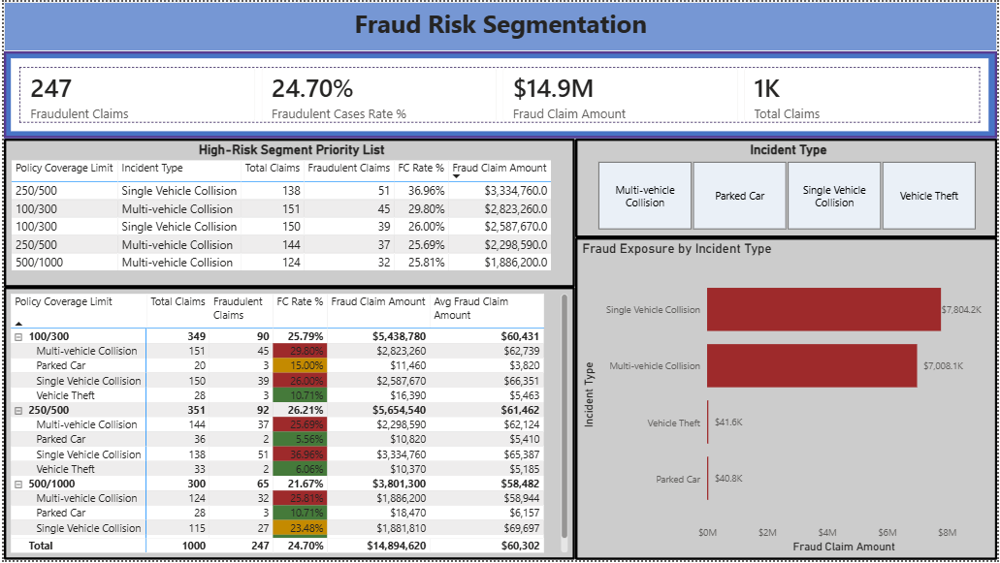

# Insurance Fraud Analytics Dashboard

End-to-end insurance claims analytics project built with a Python ETL pipeline and an interactive Power BI dashboard. The project analyzes 1,000 insurance claims to identify fraud patterns, high-risk claim segments, customer-policy relationships, and potential financial exposure.

## Project Overview

The workflow transforms a raw insurance claims dataset into a cleaned analytical dataset, then uses Power BI to explore fraud behavior across claim types, policy coverage limits, customer attributes, and policy states.

The dashboard supports two perspectives:

- **Portfolio and customer analysis** — policy mix, customer demographics, premiums, deductibles, and claim amounts.
- **Fraud investigation and risk prioritization** — fraud rates, high-risk segments, financial exposure, and detailed claim patterns.

## Tools Used

- **Python** — data cleaning and feature engineering
- **pandas** and **NumPy** — data transformation and quality checks
- **Power BI Desktop** — data modeling, DAX measures, interactive reporting, tooltips, and conditional formatting
- **GitHub** — project documentation and version control

## Dataset

The project uses an insurance claims dataset containing policy, customer, vehicle, incident, claim, and fraud-reporting attributes.

Key fields include:

- Policy information: policy state, coverage limits, annual premium, deductible, umbrella limit
- Customer information: age, gender, education level, occupation, relationship, hobbies, capital gains, and losses
- Incident information: incident type, severity, collision type, state, city, number of vehicles, witnesses, and police report availability
- Claim information: total claim amount, injury claim, property claim, and vehicle claim
- Fraud target: `fraud_reported`

## Data Preparation

The raw dataset was cleaned and transformed in Python before being loaded into Power BI.

Main steps:

- Replaced missing-value markers (`?`) with `NaN`
- Standardized column names for analysis
- Removed duplicate rows and unused fields
- Converted policy and incident date fields to datetime format
- Converted the fraud target into a binary field: `1` = fraudulent claim and `0` = non-fraudulent claim
- Cleaned numeric claim and policy columns
- Created customer tenure groups
- Created high-risk claim indicators through custom business rules
- Exported the prepared dataset as `insurance_claims_sutvarkytas.csv`

## Dashboard Preview

### Page 1 — Insurance Claims & Fraud Analysis Dashboard


### Page 2 — Customer & Policy Overview


### Page 3 — Fraud Risk Segmentation



## Power BI Report Pages

### 1. Insurance Claims & Fraud Analysis Dashboard

A portfolio-level overview focused on fraud patterns and operational filtering.

Key components:

- KPI cards for Fraud Rate %, Avg Claim Amount, Total Claims, and High Risk Claims Count
- Fraud rate by incident type and policy state
- High-risk claims table by vehicle make
- Age vs claim amount scatter plot with trend line, segmented by fraud status
- Slicers for fraud status, incident severity, and policy state

### 2. Customer & Policy Overview

A customer and policy segmentation page focused on demographic and policy-level behavior.

Key components:

- KPI cards for Avg Premium, Avg Deductible, Avg Claim Amount, and Avg Customer Tenure
- Annual Premium vs Total Claim Amount scatter plot segmented by gender
- Customer distribution by gender
- Customers by education level
- Policies by state
- Report-page tooltip showing the claim severity mix by incident type for the selected gender or policy state

### 3. Fraud Risk Segmentation

An investigation-oriented page used to prioritize high-risk fraud segments.

Key components:

- KPI cards for Fraudulent Claims, Fraudulent Cases Rate %, Fraud Claim Amount, and Total Claims
- High-Risk Segment Priority List filtered to segments with a fraud rate of at least 25%
- Matrix analysis by Policy Coverage Limit and Incident Type
- Conditional formatting for fraud rate:
  - Green `#457A3A` — low risk, below 15%
  - Gold `#C48A00` — medium risk, from 15% to below 25%
  - Burgundy `#9E2A2B` — high risk, 25% and above
- Fraud exposure by incident type bar chart
- Incident type slicer for interactive filtering
- Report-page tooltip for additional claim severity context

## Key DAX Measures

```DAX
Total Claims =
COUNTROWS(insurance_claims_sutvarkytas)

Fraudulent Claims =
CALCULATE(
    [Total Claims],
    insurance_claims_sutvarkytas[fraud_reported] = 1
)

Fraud Rate % =
AVERAGE(insurance_claims_sutvarkytas[fraud_reported])

Fraudulent Cases Rate % =
DIVIDE(
    [Fraudulent Claims],
    [Total Claims],
    0
)

Fraud Claim Amount =
CALCULATE(
    SUM(insurance_claims_sutvarkytas[total_claim_amount]),
    insurance_claims_sutvarkytas[fraud_reported] = 1
)

Avg Fraud Claim Amount =
DIVIDE(
    [Fraud Claim Amount],
    [Fraudulent Claims],
    0
)

Avg Claim Amount =
AVERAGE(insurance_claims_sutvarkytas[total_claim_amount])

Avg Premium =
AVERAGE(insurance_claims_sutvarkytas[policy_annual_premium])

Avg Deductible =
AVERAGE(insurance_claims_sutvarkytas[policy_deductable])

Avg Customer Tenure =
AVERAGE(insurance_claims_sutvarkytas[months_as_customer])

Policy Count =
COUNTROWS(insurance_claims_sutvarkytas)
```

## Key Insights

- The portfolio contains **1,000 total claims**.
- **247 claims** are flagged as fraudulent, resulting in an overall **24.70% fraud rate**.
- Fraudulent claims represent approximately **$14.9M in total claim amount exposure**.
- Single Vehicle Collision and Multi-vehicle Collision have the largest fraud exposure by incident type.
- Fraud risk varies across policy coverage limits and incident types, supporting risk-based investigation prioritization.
- High-risk segments are identified using a fraud-rate threshold of **25% or higher**.
- Customer demographics, education level, policy state, premium level, and claim amount can be explored interactively through the report.

## Dashboard Features

- Interactive slicers and cross-filtering
- DAX-based KPI calculations
- Fraud segmentation by policy coverage limit and incident type
- Conditional formatting for low, medium, and high fraud-risk segments
- Report-page tooltips for additional claim severity context
- Trend lines in scatter plots
- Currency, percentage, and compact-number formatting for readability

## Project Structure

```text
insurance-fraud-analytics/
├── insurance_claims.csv
├── insurance_claims_sutvarkytas.csv
├── insurance_data_cleaning.py
├── README.md
└── powerbi/
    ├── Insurance Claims & Fraud Analysis Dashboard.pbix
    ├── dashboard_page_1.png
    ├── dashboard_page_2.png
    └── dashboard_page_3.png
```

## Notes

- The dataset is used for portfolio and fraud-pattern analysis.
- Fraud flags are analytical labels in the supplied data and should not be interpreted as verified fraud determinations.
- Dashboard figures update dynamically with report filters and slicers.
