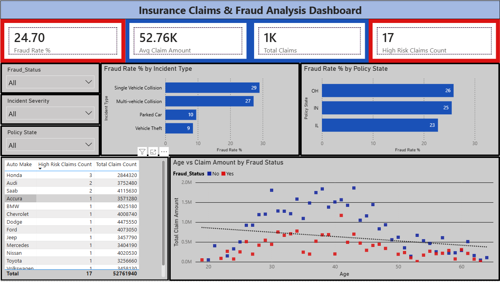
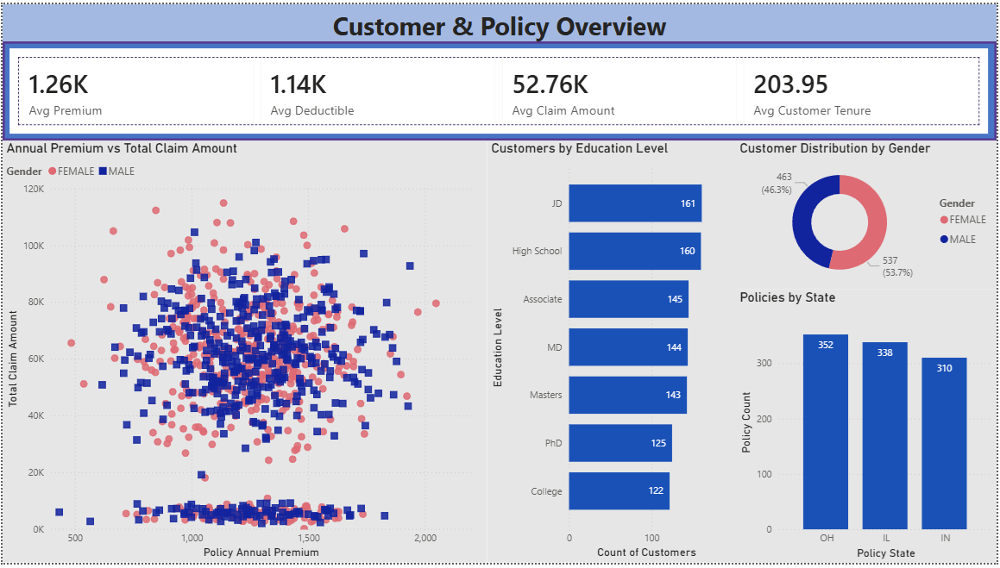

# Insurance Fraud Analytics Dashboard

End-to-end data analytics project: Python ETL pipeline → Power BI interactive dashboard, analyzing insurance claims to identify fraud patterns, risk factors, and customer-policy relationships.

## Overview
This project cleans and transforms a raw insurance claims dataset using Python (pandas), then visualizes fraud indicators, customer segments, and policy-level patterns in a two-page interactive Power BI dashboard.

## Tools Used
- Python (pandas, numpy) — data cleaning and transformation
- Power BI Desktop — dashboard design, DAX measures, interactive filtering

## Dashboard Preview

### Page 1 – Fraud & Risk Overview

### Page 2 – Customer & Policy Overview

## Key Features
- KPI cards: Total Claims, Fraud Rate %, Avg Claim Amount, High Risk Claims Count
- Fraud rate breakdown by incident type and policy state
- Age vs Claim Amount scatter plot with trend line, segmented by fraud status
- Customer & Policy Overview page with Avg Premium, Avg Deductible, Avg Claim Amount, and Avg Customer Tenure
- Customer segmentation by gender, education level, and policy state
- Annual Premium vs Total Claim Amount scatter plot for policy-level analysis
- Interactive slicers for filtering dashboard views

## Data Cleaning Steps (Python)
- Replaced missing value markers (`?`) with NaN
- Handled outliers in numeric columns using conditional logic
- Removed duplicate rows and unused columns
- Converted date columns to datetime format
- Encoded target variable (`fraud_reported`) into binary format
- Created customer tenure groups and high-risk claim flags using custom functions

## Main DAX Measures
- `Total Claims` — used to measure the size of the claims dataset and support KPI-level portfolio analysis.
- `Fraud Rate %` — shows the share of fraudulent claims and helps identify fraud concentration across segments.
- `Avg Claim Amount` — tracks the typical claim size and supports comparison across fraud status, policy state, and incident type.
- `High Risk Claims Count` — highlights the number of records flagged through risk-based business logic.
- `Avg Premium` — measures average annual premium and helps compare policy value across customer segments.
- `Avg Deductible` — summarizes deductible structure across the insurance portfolio.
- `Avg Customer Tenure` — captures average customer duration in months and supports customer profile analysis.
- `Policy Count` — counts policies in the current filter context for segmentation by state, education, and gender.

## Files
- `insurance_data_cleaning.py` — data cleaning and feature engineering script
- `insurance_claims.csv` — raw dataset
- `insurance_claims_sutvarkytas.csv` — cleaned dataset used in Power BI
- `powerbi/Insurance Claims & Fraud Analysis Dashboard.pbix` — updated Power BI report file with two report pages
- `powerbi/dashboard_page_1.png` — screenshot of Fraud & Risk Overview page
- `powerbi/dashboard_page_2.png` — screenshot of Customer & Policy Overview page
