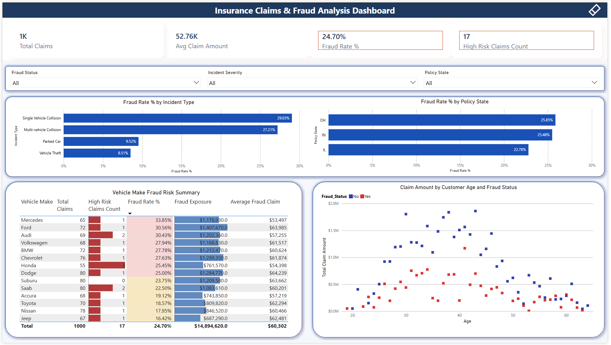
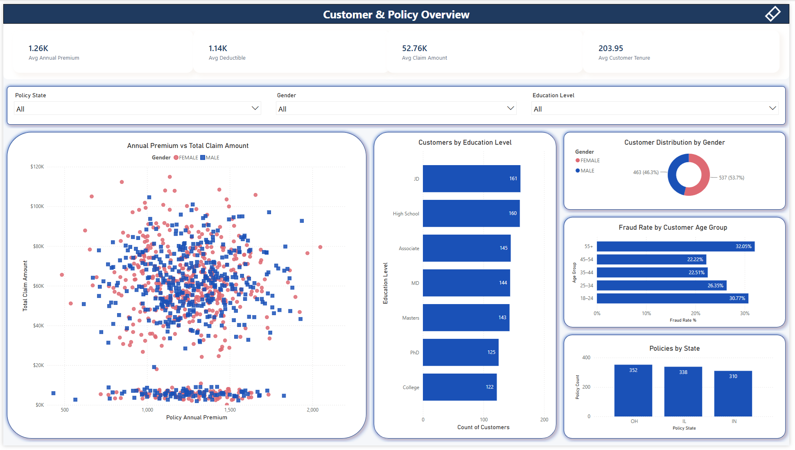
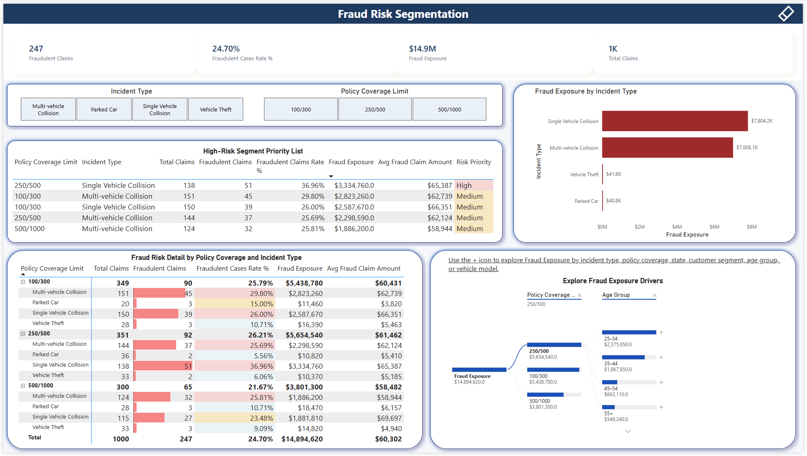

# Insurance Fraud Analytics Dashboard

End-to-end insurance claims analytics project combining a Python data-preparation workflow with an interactive three-page Power BI report.

The project analyses 1,000 insurance claims to identify fraud patterns, high-priority risk segments, customer and policy characteristics, and potential fraud exposure.



## Project Overview

The workflow transforms a raw insurance claims dataset into a cleaned analytical dataset, then uses Power BI to investigate fraud behaviour across claim types, policy coverage limits, policy states, customer attributes, vehicle information, and claim values.

The report is designed around three complementary analytical perspectives:

- **Customer and policy overview** — customer demographics, policy mix, premiums, deductibles, and claim amounts.
- **Claims and fraud analysis** — fraud rate, high-risk claims, incident-level patterns, policy-state comparisons, and age versus claim amount.
- **Fraud risk segmentation** — high-priority policy/incident combinations, financial exposure, risk severity, and interactive root-cause exploration.

## Tools Used

- **Python** — data cleaning and feature engineering
- **pandas** and **NumPy** — data transformation and quality checks
- **Power BI Desktop** — data modelling, DAX measures, interactive reporting, conditional formatting, slicers, tooltips, and Decomposition Tree analysis
- **GitHub** — project documentation and version control

## Dataset

The project uses an insurance claims dataset containing policy, customer, vehicle, incident, claim, and fraud-reporting attributes.

Key fields include:

- Policy information: policy state, coverage limits, annual premium, deductible, umbrella limit
- Customer information: age, gender, education level, occupation, relationship, hobbies, capital gains, and losses
- Vehicle information: make, model, and year
- Incident information: incident type, severity, collision type, state, city, number of vehicles, witnesses, and police-report availability
- Claim information: total claim amount, injury claim, property claim, and vehicle claim
- Fraud target: `fraud_reported`

## Data Preparation

The raw dataset was cleaned and transformed in Python before being loaded into Power BI.

Main preparation steps:

- Replaced missing-value markers (`?`) with `NaN`
- Standardised column names for analysis
- Removed duplicate rows and unused fields
- Converted policy and incident date fields to datetime format
- Converted the fraud target to a binary field: `1` for fraudulent claims and `0` for non-fraudulent claims
- Cleaned numeric claim and policy fields
- Created customer tenure groups
- Created high-risk claim indicators using custom business rules
- Exported the prepared dataset as `insurance_claims_sutvarkytas.csv`

## Dashboard Preview

### 1. Customer & Policy Overview


This page explores customer and policy characteristics, including:

- Average annual premium, deductible, claim amount, and customer tenure
- Annual premium versus total claim amount by gender
- Customer distribution by gender and education level
- Policy distribution by state
- Fraud rate by customer age group
- Interactive filtering by policy state, gender, and education level

### 1. Insurance Claims & Fraud Analysis Dashboard



This page provides a portfolio-level fraud monitoring view, including:

- KPI cards for fraud rate, average claim amount, total claims, and high-risk claims
- Fraud rate by incident type and policy state
- Vehicle make fraud risk summary with claim volume, fraud rate, fraud exposure, and average fraud claim severity
- Conditional formatting using data bars and risk-based backgrounds
- Claim amount by customer age and fraud status
- Interactive filtering by fraud status, incident severity, and policy state

### 3. Fraud Risk Segmentation



This investigation-focused page supports risk prioritisation and root-cause exploration:

- KPI cards for fraudulent claims, fraud rate, fraud exposure, and total claims
- High-Risk Segment Priority List combining policy coverage limit, incident type, total claims, fraudulent claims, fraud rate, fraud exposure, average fraud claim, and risk priority
- Fraud risk detail matrix by policy coverage limit and incident type
- Fraud exposure by incident type
- Incident Type and Policy Coverage Limit slicers
- Interactive Decomposition Tree for exploring fraud exposure drivers by incident type, policy coverage, policy state, customer segment, age group, and vehicle attributes

## Key DAX Measures

```DAX
Total Claims =
COUNTROWS(insurance_claims_sutvarkytas)

Fraudulent Claims =
CALCULATE(
    [Total Claims],
    insurance_claims_sutvarkytas[fraud_reported] = 1
)

Fraud Rate % =
DIVIDE(
    [Fraudulent Claims],
    [Total Claims],
    0
)

Fraud Exposure =
CALCULATE(
    SUM(insurance_claims_sutvarkytas[total_claim_amount]),
    insurance_claims_sutvarkytas[fraud_reported] = 1
)

Average Fraud Claim =
DIVIDE(
    [Fraud Exposure],
    [Fraudulent Claims],
    0
)

Avg Claim Amount =
AVERAGE(insurance_claims_sutvarkytas[total_claim_amount])

Avg Premium =
AVERAGE(insurance_claims_sutvarkytas[policy_annual_premium])

Avg Deductible =
AVERAGE(insurance_claims_sutvarkytas[policy_deductable])

Avg Customer Tenure =
AVERAGE(insurance_claims_sutvarkytas[months_as_customer])

Policy Count =
COUNTROWS(insurance_claims_sutvarkytas)
```

## Key Insights

- The portfolio contains **1,000 total claims**.
- **247 claims** are flagged as fraudulent, producing an overall **24.70% fraud rate**.
- Fraudulent claims account for approximately **$14.9M in fraud exposure**.
- Single-vehicle collisions and multi-vehicle collisions represent the largest fraud-exposure categories.
- Fraud risk differs by policy coverage limit and incident type, enabling more targeted investigation priorities.
- The highest-priority segment displayed is **250/500 coverage with single-vehicle collision**, with 51 fraudulent claims, a 36.96% fraud rate, and approximately $3.33M in fraud exposure.
- Customers aged **55+** show the highest fraud rate in the dashboard’s age-group view.
- The Decomposition Tree enables interactive exploration of the combinations contributing most to total fraud exposure.

## Dashboard Features

- Interactive slicers and cross-filtering
- DAX-based KPIs for claims, fraud rate, exposure, and claim severity
- Conditional formatting with data bars and risk-level background colours
- Fraud segmentation by incident type and policy coverage limit
- Customer segmentation by gender, education level, age group, and policy state
- Scatter plots with fraud-status comparison and trend-line analysis
- Decomposition Tree for interactive root-cause analysis
- Currency, percentage, and compact-number formatting for readability
- Accessibility-oriented titles, labels, colour use, and visual hierarchy

## Project Structure

```text
insurance-fraud-analytics/
├── README.md
├── insurance_claims.csv
├── insurance_claims_sutvarkytas.csv
├── insurance_data_cleaning.py
└── powerbi/
    ├── Insurance Claims & Fraud Analysis Dashboard.pbix
    ├── 01-customer-policy-overview.png
    ├── 02-claims-fraud-analysis.png
    └── 03-fraud-risk-segmentation.png
```

## Notes

- The dataset is used for portfolio and fraud-pattern analysis.
- Fraud flags are analytical labels supplied with the dataset and do not represent verified fraud determinations.
- Dashboard figures update dynamically when users apply slicers or select visual elements.
